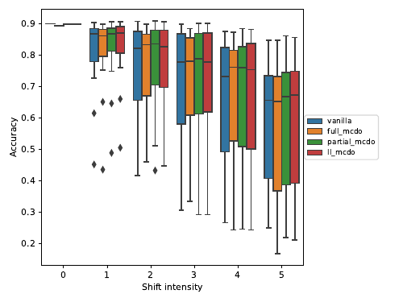
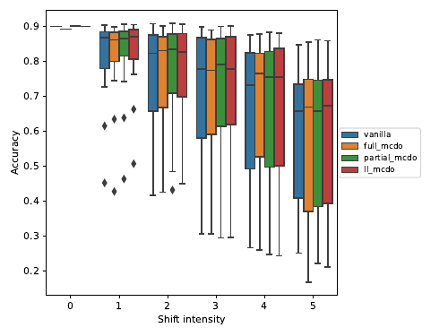
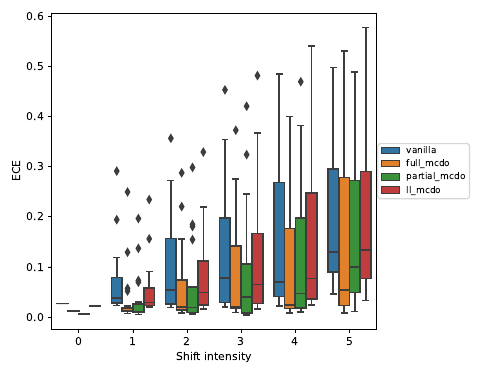
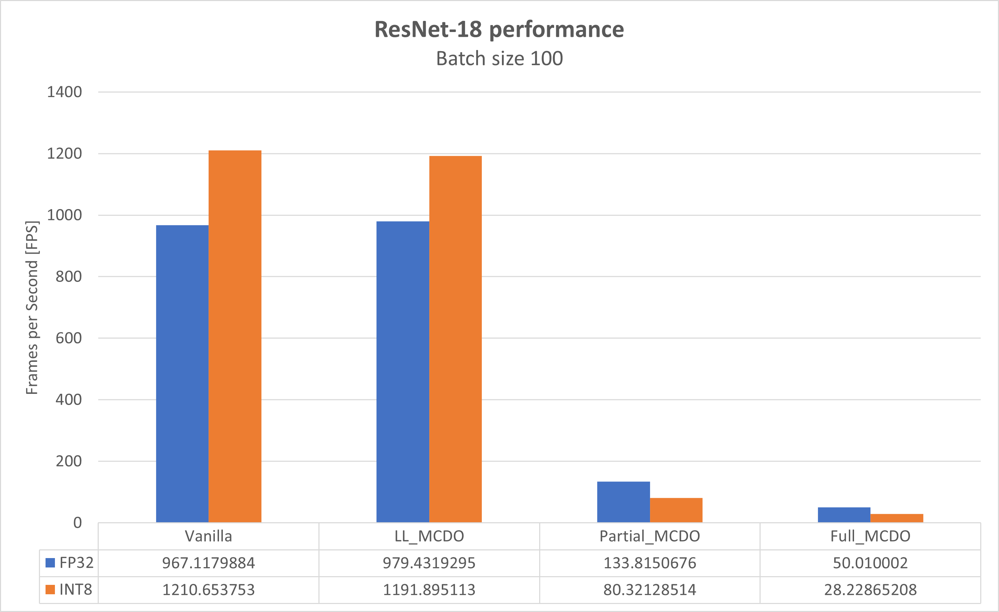
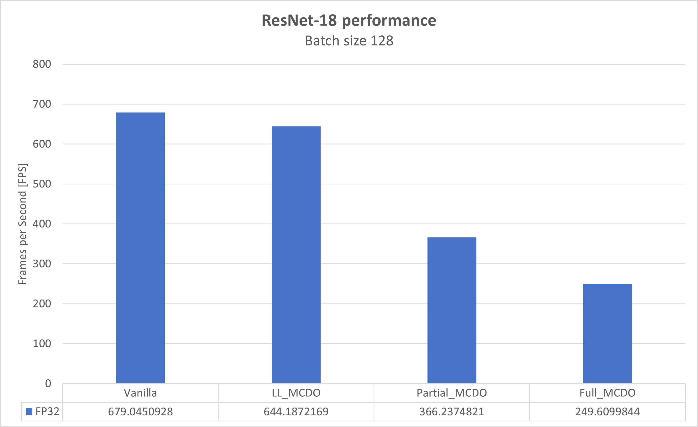

# End-to-end example of Axolotl with ResNet-18 and CIFAR-10

This document illustrates  and end-to-end example of how to use Axolotl using the ResNet-18 model and CIFAR-10 dataset provided with this repository.

## Preliminary note

This guide assumes the proper Python environment and dependencies are installed as illustrated in the file [INSTALL.md](INSTALL.md).

## Building the vanilla ResNet-18 model

First step is to build the vanilla ResNet-18 model. We will use the `build` subcommand of the `ResNet18.py` entry point script. We will save the model in `experiment_models/tf` folder, with `vanilla` name and format `h5`.

```bash
python ResNet18.py build --save_to experiment_models/tf \
                         --save_filename vanilla \
                         --save_format h5
```

The command will generate the file `experiment_models/tf/vanilla.h5`. This file contains a non-trained vanilla ResNet-18 model. You can visualize the model with tools like [Netron](https://netron.app/). In fact, any of the models generated by Axolotl should be supported by Netron.

## Adding MCDO to the vanilla ResNet-18 model

Once the vanilla model is generated, we can add dropout layers to it to generate the different MCDO variants we want to study. In this guide, we will generate three variants:
- Last-Layer MCDO
  - Only one dropout layer is added to the last fully-connected layer
- Partial MCDO
  - Dropout layers are added to all convolutional and fully-connected layers starting from the 11th convolution found in the model
- Full MCDO
  - Dropout layers are added to all convolutional and fully-connected layers of the model, skipping the first convolutional layer

To generate each one of those, we need to inspect the model and find the name of layer. For each case, we found that we wanted to add dropout layers starting from the layer with name `dense`, `conv2d_10` and `conv2d_1`, depending of the MCDO variant (last-layer, partial and full MCDO respectively).

With that information, we can start running some commands:

```bash
# Last-layer MCDO
python ResNet18.py mcdo --model experiment_models/tf/vanilla.h5 \
                        --save_to experiment_models/tf \
                        --save_filename ll_mcdo \
                        --save_format h5 \
                        --starting_layer dense \
                        --droprate 0.319811

# Partial MCDO
python ResNet18.py mcdo --model experiment_models/tf/vanilla.h5 \
                        --save_to experiment_models/tf \
                        --save_filename partial_mcdo \
                        --save_format h5 \
                        --starting_layer conv2d_10 \
                        --droprate 0.054988

# Full MCDO
python ResNet18.py mcdo --model experiment_models/tf/vanilla.h5 \
                        --save_to experiment_models/tf \
                        --save_filename full_mcdo \
                        --save_format h5 \
                        --starting_layer conv2d_1 \
                        --droprate 0.054988
```

You should have noticed that we used specific values for the dropout rate to use for each of the MCDO variants. After some experimention, we found that those specific values (obtained from examples in [Google's Uncertainty Baselines repository](https://github.com/google/uncertainty-baselines)), are the ones that provided us with the best results.

The above commands should have generated the new files `experiment_models/tf/ll_mcdo.h5`, `experiment_models/tf/partial_mcdo.h5` and `experiment_models/tf/full_mcdo.h5`. Each of those files are the same model as the vanilla ResNet-18 model generated in the first step, but with dropout layers added accordingly. As before, none of the new models is trained. As a final remainder, the dropout layers will run during both training and inference. 

## Training the models

Now that we have all the TensorFlow models, it is time to train the models. For training, we use the CIFAR-10 dataset. As before, we need to use a subcommand, in this case, the `train` one.

```bash
# Vanilla ResNet-18
python ResNet18.py train --model experiment_models/tf/vanilla.h5 \
                         --save_to experiment_models/tf \
                         --save_filename vanilla \
                         --save_format h5 \
                         --epochs 200 \
                         --batch 7 \
                         --initial_learning_rate 0.000717 \
                         --tensorboard_logdir tensorboard_logs/vanilla

# Last-layer MCDO
python ResNet18.py train --model experiment_models/tf/ll_mcdo.h5 \
                         --save_to experiment_models/tf \
                         --save_filename ll_mcdo \
                         --save_format h5 \
                         --epochs 200 \
                         --batch 16 \
                         --initial_learning_rate 0.000313 \
                         --tensorboard_logdir tensorboard_logs/ll_mcdo

# Partial MCDO
python ResNet18.py train --model experiment_models/tf/partial_mcdo.h5 \
                         --save_to experiment_models/tf \
                         --save_filename partial_mcdo \
                         --save_format h5 \
                         --epochs 200 \
                         --batch 7 \
                         --initial_learning_rate 0.000250 \
                         --tensorboard_logdir tensorboard_logs/partial_mcdo

# Full MCDO
python ResNet18.py train --model experiment_models/tf/full_mcdo.h5 \
                         --save_to experiment_models/tf \
                         --save_filename full_mcdo \
                         --save_format h5 \
                         --epochs 200 \
                         --batch 5 \
                         --initial_learning_rate 0.000250 \
                         --tensorboard_logdir tensorboard_logs/full_mcdo
```

As before, we have used a set of specific values for batch size and initial learning rate. After some experimentation, we found that the values from provided by Google's Uncertainty Baselines repository were the best ones we could use to get the minimum loss and maximum accuracy.

Please notice that, with the above commands, we overwrote the non-trained models with the trained version of the same models. Now, all the models are trained and prepare for branching.

The reason to perform training before branching is that, if you train and then branch, the weights of each branch will be the same, thus adding uncertainty by using the dropout layers and sampling. In the case of branch and then train, each branch will have different weights, resembling more to an Ensemble model. Even if that can make a case study on its own, it was out of our current experiment.

## Branch the MCDO models

Now that we have a trained version of all the MCDO models (and the vanilla ResNet-18 as well), we can branch the model. Branching will generate a new model that can be decomposed as:
- Backbone
- MCDO branches
  - MCDO branch 1
  - MCDO branch 2
  - ...
  - MCDO branch N

The current framework supports up to 10 branches and a minimum of 2. For this study, we decided to go with 5 branches, since more branches start to provide diminishing results.

Please note that, as stated before, each branch will have use the same weights as the others (a copy, in fact), therefore, uncertainty is added by running the same part of the model several times (i.e., sampling) applying different masks via the dropout layers that we have inserted.

To generate the branched MCDO models, we will use the subcommand `branch`. Note that we do not need to specify from where to start branching, that is handle internally by the framework.

```bash
# Last-layer MCDO variant
python ResNet18.py branch --model experiment_models/tf/ll_mcdo.h5 \
                          --save_to experiment_models/tf \
                          --save_filename ll_mcdo \
                          --save_format h5 \
                          --n_branches 5

# Partial MCDO variant
python ResNet18.py branch --model experiment_models/tf/partial_mcdo.h5 \
                          --save_to experiment_models/tf \
                          --save_filename partial_mcdo \
                          --save_format h5 \
                          --n_branches 5

# Full MCDO variant
python ResNet18.py branch --model experiment_models/tf/full_mcdo.h5 \
                          --save_to experiment_models/tf \
                          --save_filename full_mcdo \
                          --save_format h5 \
                          --n_branches 5
```

Note again that we are overwriting the non-branched variants with the branched versions. The only thing left to do is to convert the models to Tensorflow Lite, applying quantisation if desired.

## Convert (and quantise) to Tensorflow Lite

As a last step messing with the models, we will convert them to Tensorflow Lite models and we will perform post-training quantisation. We will use the subcommand `convert` for this.

```bash
# FP32 vanilla ResNet-18
python ResNet18.py convert --model experiment_models/tf/vanilla.h5 \
                           --save_to experiment_models/tflite \
                           --save_filename fp32_vanilla

# INT8 vanilla ResNet-18
python ResNet18.py convert --model experiment_models/tf/vanilla.h5 \
                           --save_to experiment_models/tflite \
                           --save_filename int8_vanilla \
                           --int8

# FP32 Last-Layer MCDO
python ResNet18.py convert --model experiment_models/tf/ll_mcdo.h5 \
                           --save_to experiment_models/tflite \
                           --save_filename fp32_ll_mcdo

# INT8 Last-Layer MCDO
python ResNet18.py convert --model experiment_models/tf/ll_mcdo.h5 \
                           --save_to experiment_models/tflite \
                           --save_filename int8_ll_mcdo \
                           --int8

# FP32 Partial MCDO
python ResNet18.py convert --model experiment_models/tf/partial_mcdo.h5 \
                           --save_to experiment_models/tflite \
                           --save_filename fp32_partial_mcdo

# INT8 Partial MCDO
python ResNet18.py convert --model experiment_models/tf/partial_mcdo.h5 \
                           --save_to experiment_models/tflite \
                           --save_filename int8_partial_mcdo \
                           --int8

# FP32 Full MCDO
python ResNet18.py convert --model experiment_models/tf/full_mcdo.h5 \
                           --save_to experiment_models/tflite \
                           --save_filename fp32_full_mcdo

# INT8 Full MCDO
python ResNet18.py convert --model experiment_models/tf/full_mcdo.h5 \
                           --save_to experiment_models/tflite \
                           --save_filename int8_full_mcdo \
                           --int8
```

Up to this point, we already have all the models generated. Now it is just a matter of checking how good the models are by running inference and benchmarking the models.

## Evaluating the models

For evaluation, we will use two different versions of the CIFAR-10 dataset, the vanilla CIFAR-10 and the [corrupted version of CIFAR-10](https://github.com/hendrycks/robustness). We will use the Tensorflow Lite models for this experiment. As for any other step performed before, we will use a specific subcommand, in this case, the `inference` one.

For the evaluation, we want to measure two different things:
1. How good is each model in terms of accuracy and ECE
1. How good each model handles corruption

Therefore, we need to perform several runs with each test dataset and for each model. For the vanilla CIFAR-10 dataset, only one run with each model suffice. For the corrupted CIFAR-10, there are a total of 95 combinations of corruption type and severity (i.e., 19 kinds of corruption, 5 levels of severity each).

We will store the data in a CSV file per model.

```bash
# Declare all corruption types to iterate over them later
corruption_types=(brightness contrast defocus_blur elastic fog frost frosted_glass_blur gaussian_blur gaussian_noise impulse_noise jpeg_compression motion_blur pixelate saturate shot_noise snow spatter speckle_noise zoom_blur)

for precision in fp32 int8
do
    # Use first the vanilla CIFAR-10 dataset
    for model in vanilla ll_mcdo partial_mcdo full_mcdo
    do
        outputFile=csvs/${precision}_${model}.csv
        echo "corruption,corruption_level,accuracy,brier_score,log_prob,ece" > ${outputFile}
        python ResNet18.py inference --model experiment_models/tflite/${precision}_${model}.tflite \
                                     --batch 50  | grep -A1 "accuracy" | tail -n1 >> ${outputFile}
    done

    # Now use the corrupted CIFAR-10 dataset, iterating over all the corruption types and severity
    for corruption in ${corruption_types[@]}
    do
        for corruption_level in {1..5}
        do
            for model in vanilla ll_mcdo partial_mcdo full_mcdo
            do
                outputFile=csvs/${precision}_${model}.csv
                python ResNet18.py inference --model experiment_models/tflite/${precision}_${model}.tflite \
                                             --corruption ${corruption} \
                                             --corruption_level ${corruption_level} \
                                             --batch 50 | grep -A1 "accuracy" | tail -n1 >> ${outputFile}
            done
        done
    done
done
```

When the above runs finish, all the data we need can be found in the CSV files generated. We can use now the [plot.py](plot.py) script to generate accuracy and ECE plots as the ones below, obtained from using the models that can be found in this repository.

```bash
python plot.py --input csvs/fp32_vanilla.csv \
                       csvs/fp32_full_mcdo.csv \
                       csvs/fp32_partial_mcdo.csv \
                       csvs/fp32_ll_mcdo.csv

python plot.py --input csvs/int8_vanilla.csv \
                       csvs/int8_full_mcdo.csv \
                       csvs/int8_partial_mcdo.csv \
                       csvs/int8_ll_mcdo.csv
```

### FP32 models

 

The plots above show accuracy (left) and ECE (right) when using the vanilla CIFAR-10 dataset (shift intensity equal to 0) and when using the corrupted CIFAR-10 dataset (shift intensities 1 to 5). Each shift intensity contains the data all corruption types using that specific level of corruption.

We can see how, when no corruption is in place, all models present a similar accuracy. Differences can be observed as we add corruption and we increase severity. For ECE, we can observe how is consistently lower for each case when using the MCDO variants. We can observe how, the more dropout layers are inserted in the model, the lower ECE we obtain.

ECE stands for Expected Calibration Error, and is a metric that represents how confident the model is of a given prediction. For ECE, the closest to zero the better. Therefore, we can observe how, as more dropout layers are present in the model, the higher the confidence (i.e., lower ECE) is.

### INT8 models

 

When using the quantised models, we can observe negligible differences in accuracy and in ECE, meaning that we could use, for this specific case, FP32 and INT8 models interchangeably.

## Benchmarking the models

As a last step, we can benchmark any of the models we generated. In this example we will only benchmark the Tensorflow Lite models. For this step we will use the sub-command `benchmark`. The framework will use synthetic data for the benchmarking.

```bash
for precision in fp32 int8
do
    for model in vanilla ll_mcdo partial_mcdo full_mcdo
    do
        python ResNet18.py benchmark --model experiment_models/tflite/${precision}_${model}.tflite
                                     --batch 100 \
                                     --repeats 100
    done
done
```

The output of the benchmark will be in a CSV format, presenting different information such as:
- Batch size used
- Model size in MB
- Mean, median, maximum, minimum latency, along with standard deviation, per inference

We ran a set of experiments on an Ampere eMAG 8180, featuring 32 cores @ 2.8 GHz. The plot below shows the results we obtained for the different model variants.



Results for the last-layer MCDO are considerably good (i.e., similar performance), but as observed during the evaluation, it is still slightly better than vanilla. Please remember that, for the MCDO models, MCDO layers will execute several times, so the overhead is not noticeable in this case.

For the partial and full MCDO, we can see a big drop in performance. The main culprit being the addition of the Dropout layers. Current Tensorflow Lite implementation of the Dropout layer provided in this repository is still a Proof-of-Concept (PoC) that can be tuned and optimized. In this sense, the current implementation we offer is sequential and does not offer a quantised version. The quantise part is important, since, the current Tensorflow Lite models need to dequantise and quantise again for every Dropout layer we inserted, thus paying a huge overhead.

As an example of this overhead, below the same plot using the Tensorflow models, where the Dropout implementation is the one provided by the Tensorflow ML framework. We can see how performance drop is not as big as in the Tensorflow Lite models.



# Final thoughts

We have shown how to use Axolotl to study the impact in terms of accuracy and uncertainty of a ResNet-18 model using CIFAR-10 and corrupted CIFAR-10 datasets. Even if performance in Tensorflow Lite models is still not yet optimized, we can already see the benefits of using MCDO while under corruption. There is still a work to do in terms of Tensorflow Lite Dropout implementation (e.g., parallelization, quantised version, etc.)
